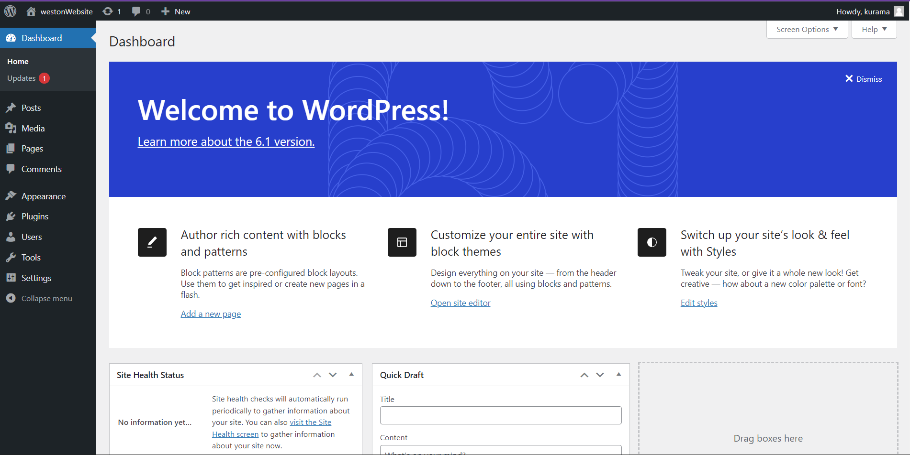

# Docker Documentation
## Docker Install
-  For my Docker install, I navigated to https://docs.docker.com/desktop/install/windows-install/ and downloaded the Windows install o.
- I receved this alert after restarting my laptop and running Docker:
    - WSL 2 installation is incomplete

            The WSL 2 Linux kernel is now installed using a separate MSI update package. Please click the link and follow the instructions to install the kernel update:

             https://aka.ms/wsl2kernel

            Press restart after installing the Linux kernel
    - I had to install the WSL Linux Kernel Package for x64 Machines and run the package, the, launch powershell and set WSL 2 as my default version when installing new Linux distributions:
        -  `wsl --set-default-version 2` 
## Wordpress Install
    Used this guide: https://www.hostinger.com/tutorials/run-docker-wordpress#Step_2_-_Set_Up_WordPress_Container_on_Docker
In Powershell: 
1. Make a new directory for Wordpress:  `mkdir wordpress`
 2. Change directory: `cd wordpress`
 3. Open Visual Studio Code (or other code editor) and create a compose file using yaml. 
 4. Copy the compose file to the Wordpress directory: `cp `*C://Path/to/compose.yml*
    - Make sure you are still inside Wordpress directory when you run command
5. Use `ls` to make sure compose file is in the Wordpress directory 
 6. Run `docker compose up -d` to start the MySQL and Wordpress containers

## Wordpress Setup
 Enter `http://localhost:8000/` in browser and ordpress setup screen should appear. 
 Fill out the fields and the website will be created. 

## Screenshots

